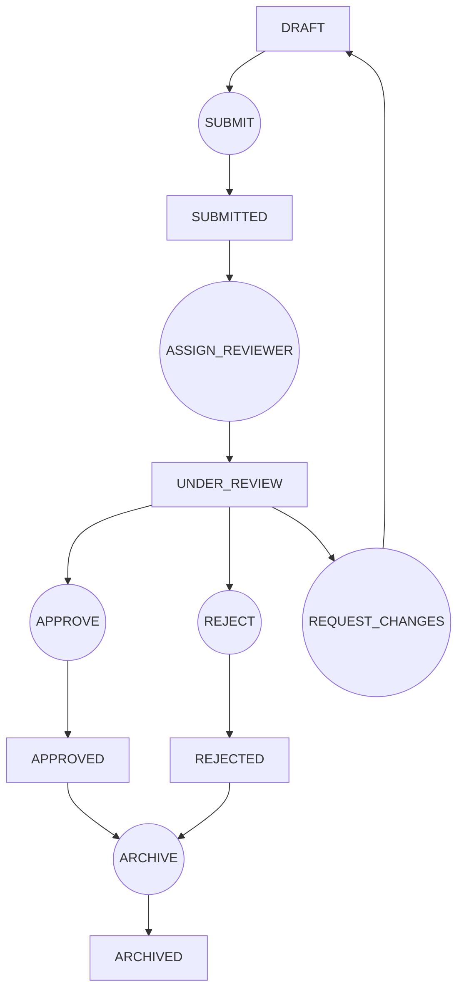

# README

Document processing system that manages the lifecycle of documents. This is intended as a learning exercise about FSMs.

## The flow

```mermaid
flowchart TD
    DRAFT
    SUBMITTED
    UNDER_REVIEW
    APPROVED
    REJECTED
    ARCHIVED
    
    SUBMIT((SUBMIT))
    ASSIGN_REVIEWER((ASSIGN_REVIEWER))
    APPROVE((APPROVE))
    REJECT((REJECT))
    REQUEST_CHANGES((REQUEST_CHANGES))
    ARCHIVE((ARCHIVE))
    
    DRAFT --> SUBMIT --> SUBMITTED
    SUBMITTED --> ASSIGN_REVIEWER --> UNDER_REVIEW
    UNDER_REVIEW --> APPROVE --> APPROVED
    UNDER_REVIEW --> REJECT --> REJECTED
    UNDER_REVIEW --> REQUEST_CHANGES --> DRAFT
    APPROVED --> ARCHIVE
    REJECTED --> ARCHIVE
    ARCHIVE --> ARCHIVED
        
```